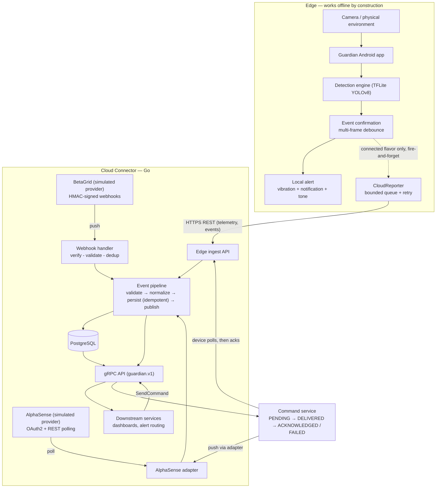

# Guardian

On-device, real-time hazard detection for Android, connected to a Go cloud
backend that normalizes events from heterogeneous IoT providers, persists
them in PostgreSQL, and exposes them to downstream services over gRPC —
without ever making local safety depend on the cloud.

## Problem

A fire alarm that needs the internet is a worse fire alarm. Guardian starts
from that constraint: detection (CameraX → TensorFlow Lite YOLOv8 → decode →
NMS → multi-frame event confirmation → local alert) runs entirely on the
phone, with **no network dependency**. But a detector that only alerts the
person holding the phone doesn't scale to a fleet: operations teams need
telemetry, a normalized event history across many devices *and* many vendors'
hardware, and a safe way to send configuration commands back out. That
edge/cloud split — local autonomy plus centralized integration — is the core
problem of most IoT platforms, and it is what this repository demonstrates
end to end.

## Architecture



Commands flow the other way: a downstream service calls `SendCommand` over
gRPC; Guardian devices **poll** for pending commands and post results (a
phone that must work offline cannot hold a broker connection), while
push-capable providers get commands through their adapter. Command types are
deliberately safe: `GET_STATUS`, `START_MONITORING`, `STOP_MONITORING`,
`UPDATE_MONITORING_CONFIG` — nothing physical.

## Repository layout

| Path | What it is |
|---|---|
| `app`, `core/*`, `detector/*`, `feature/*` | The Android application (Kotlin, Hilt, Compose, CameraX, TFLite) |
| `core/cloud` | **New:** pure-JVM edge→cloud reporting (wire contract, queueing, retry) |
| `cloud-connector` | **New:** the Go service — ingest REST API, provider adapters, OAuth2 client, webhook handling, PostgreSQL, gRPC, observability |
| `cloud-connector/cmd/providersim` | Simulated external providers (fake OAuth2 IdP + REST API, webhook pusher) for local end-to-end runs |
| `cloud-connector/deploy/k8s` | Kubernetes manifests (Deployment, Service, ConfigMap, Secret refs, probes) |
| `.github/workflows/ci.yml` | CI: gofmt, go vet, Go tests (with real Postgres), Go build, Docker build, Android JVM tests |
| `docs/` | Research + implementation records, including `docs/cloud/IMPLEMENTATION_PLAN.md` |

## Key engineering decisions

- **Detection stays local; the cloud only ever *additionally* observes.**
  The `offline` product flavor has no INTERNET permission at all (verified in
  the built APK), and in the `connected` flavor the reporter is fire-and-
  forget: local alerting has already fired before anything is enqueued for
  the cloud, `reportEvent` never blocks and never throws, and a full cloud
  outage costs telemetry, never detection.
- **One provider seam, adapters own their mess.** `internal/provider` defines
  small capability interfaces (`DevicePoller`, `EventPoller`,
  `CommandSender`). The two simulated providers were designed to disagree
  with each other on purpose — OAuth2+polling vs signed webhooks, 0–100
  scores vs categorical certainty, `"fire"` vs `"FLAME"`, RFC3339 vs unix
  seconds — and every one of those differences is contained inside
  `provider/alphasense` and `provider/betagrid`. The rest of the service
  sees only `internal/domain` types.
- **Idempotency lives in the database, not in memory.** Every event carries a
  dedup key (edge: the on-device event UUID; webhooks: the provider delivery
  ID) behind a unique constraint with `ON CONFLICT DO NOTHING`; command
  creation takes an idempotency key the same way. Redelivery and retry are
  therefore *always* safe, which makes the retry strategy boring — the best
  kind.
- **Retries are centralized and classified.** `internal/reliability` is the
  one retry implementation: exponential backoff with full jitter, permanent
  vs transient error classification (4xx never retried, 429/5xx/transport
  retried), context cancellation always wins.
- **OAuth2 lifecycle is explicit.** `internal/oauth` caches tokens, refreshes
  early (30 s skew), single-flights concurrent refreshes, recovers from
  `invalid_grant` by re-authing, and handles server-side revocation (one
  fresh-token retry on 401). All of it unit-tested against a scriptable fake
  IdP.
- **Webhooks: authenticate → parse → window → dedup → process**, in that
  order. Unsigned garbage never reaches a parser; signed-but-malformed
  payloads go to a dead-letter table (never silently accepted); duplicates
  answer 200 so the sender stops retrying.
- **gRPC is the internal boundary; REST is the device boundary.** Devices and
  webhooks speak HTTPS/JSON (simple, proxy-friendly, debuggable); platform
  services get a small versioned protobuf API (`guardian.v1`: GetDevice,
  ListDevices, ListRecentEvents, StreamEvents, SendCommand, GetCommand).
- **PostgreSQL because the problems here are relational** — uniqueness,
  state-machine transitions guarded in SQL (`UPDATE … WHERE state = …`),
  `FOR UPDATE SKIP LOCKED` for exactly-once command claiming — and one boring
  database is easier to defend than two exciting ones. Migrations are
  embedded in the binary and applied at startup. Provider tokens are
  AES-256-GCM encrypted at rest with a key from the environment.

## Failure handling (concrete)

| Failure | Behavior |
|---|---|
| Provider returns 500 / times out | Retried with backoff+jitter inside the adapter; a still-failing poll cycle is logged+counted, watermark kept, next cycle re-covers the window |
| Provider returns 429 | Treated as transient, backed off and retried |
| Provider returns 404/4xx | Permanent: no retry, error surfaced in logs/metrics |
| Access token expires | Refresh grant 30 s before expiry; single-flight under concurrency |
| Refresh token rejected (`invalid_grant`) | Fall back to a fresh client-credentials grant instead of wedging |
| Token revoked server-side (401 mid-flight) | Invalidate cache, retry once with a fresh token; a second 401 is permanent |
| Duplicate webhook delivery | 200 + `webhook_duplicates_total`; processed exactly once (DB constraint) |
| Malformed webhook (signed) | 400 + dead-letter row with reason; never silently accepted |
| Unsigned/tampered webhook | 401 before any parsing or storage |
| Replayed old webhook | Rejected by the timestamp window (default 5 min) |
| Duplicate edge event (retry after lost response) | 202 with `"duplicate": true`; stored once |
| Database down | `/readyz` fails (K8s stops routing); startup waits and retries instead of crash-looping |
| Edge device offline | Commands wait in PENDING until polled; expired ones are FAILED by a reaper (TTL 24 h) |
| Device acks a command twice | Second ack → 409 (state machine enforced in SQL) |
| Cloud connector down / unreachable from the phone | Local detection and alerts unaffected; events queue in a bounded in-memory buffer with backoff, oldest dropped on overflow |
| Cloud connector restart | Safe: all state in Postgres; edge/provider redelivery is idempotent |

## Running locally

Prereqs: Docker with the compose plugin.

```bash
cd cloud-connector
docker compose up --build
```

This starts PostgreSQL, the connector (HTTP :8080, gRPC :9090) and the
provider simulator, already wired: the connector polls the fake AlphaSense
API with real OAuth2 (90 s tokens, so refresh actually happens) and receives
signed BetaGrid webhooks (including deliberate duplicates). Then:

```bash
# health / readiness / metrics
curl localhost:8080/healthz
curl localhost:8080/readyz
curl localhost:8080/metrics | grep events_

# act as a Guardian device: send telemetry + a confirmed event
curl -X POST localhost:8080/v1/edge/telemetry \
  -H 'Authorization: Bearer dev-edge-token' -H 'Content-Type: application/json' \
  -d '{"deviceId":"demo-phone","reportedAtMs":'"$(date +%s000)"',"monitoringStatus":"MONITORING","modelStatus":"READY","inferenceLatencyMs":40,"processedFps":4,"droppedFrames":0,"confirmedEvents":0,"appVersion":"0.1.0"}'

curl -X POST localhost:8080/v1/edge/events \
  -H 'Authorization: Bearer dev-edge-token' -H 'Content-Type: application/json' \
  -d '{"deviceId":"demo-phone","eventId":"evt-1","type":"FIRE","confidence":0.83,"firstSeenMs":'"$(date +%s000)"',"confirmedAtMs":'"$(date +%s000)"',"appVersion":"0.1.0"}'

# poll commands as the device / ack one
curl 'localhost:8080/v1/edge/commands?deviceId=demo-phone' -H 'Authorization: Bearer dev-edge-token'
```

The gRPC API is on `localhost:9090` (`guardian.v1.ConnectorService`, proto in
`cloud-connector/api/proto`); any gRPC client (e.g. `grpcurl` with the proto
file) can `ListRecentEvents` or `SendCommand`.

**Android app:** open the repo in Android Studio (JDK 17, SDK 35). The
default `offlineDebug` variant is the app exactly as before — no network
permission. To connect a device/emulator to a locally running connector:

```bash
./gradlew :app:assembleConnectedDebug \
  -Pguardian.cloud.baseUrl=http://10.0.2.2:8080 \
  -Pguardian.cloud.apiToken=dev-edge-token
```

The fire/smoke model is intentionally not bundled (licensing — see
`detector/firesmoke/src/main/assets/models/PROVISIONING.md`); without it the
app shows *model not provisioned* and produces zero detections. There is no
mock detection path.

## Testing

What actually runs, and where:

- **Go unit tests — 93 tests** (`cd cloud-connector && go test ./...`), all
  hermetic: OAuth lifecycle against a fake IdP (expiry, early refresh,
  `invalid_grant` recovery, single-flight, no-retry-on-401), retry/backoff
  semantics incl. context cancellation, both providers' normalization
  (table-driven, incl. malformed inputs), webhook handling (signature,
  tampering, duplicates, dead-letters, stale timestamps, size caps), command
  state machine + idempotency, edge API validation/auth, token crypto.
- **Go integration tests — 8 tests** against real PostgreSQL (skipped unless
  `TEST_DATABASE_URL` is set; CI provides a Postgres service): migrations,
  unique-constraint idempotency, SQL transition guards, `SKIP LOCKED`
  exactly-once claiming, command expiry, encrypted-at-rest verification.
- **Kotlin JVM tests — 61 tests** (`./gradlew :core:model:test
  :core:detection:test :core:cloud:test`): the existing 49 detection-pipeline
  tests (untouched) plus 12 new tests for the cloud contract JSON and the
  queueing reporter (delivery, retry, permanent-failure drop, give-up,
  disabled short-circuit, non-blocking enqueue).
- **Verified end-to-end in development:** `connector + Postgres + providersim`
  running together — OAuth polling with live token refresh, signed + duplicate
  webhooks, edge telemetry/events incl. duplicate flagging, gRPC
  ListDevices/ListRecentEvents/SendCommand (idempotent), full command
  lifecycle to 409 on double-ack, metrics endpoint.
- **Not covered:** Android instrumentation/on-device tests (need an
  emulator/phone; the app builds — both flavors — and APK permissions were
  verified with `aapt`), and load/perf testing of the connector.

## Limitations (honest)

**IMPLEMENTED & TESTED:** everything in the Testing section above.

**SIMULATED:** AlphaSense and BetaGrid are fictitious providers implemented
by `cmd/providersim` so the integration patterns (OAuth2 lifecycle, signed
webhooks, schema normalization) can be demonstrated and tested for real.
They are not, and are not presented as, commercial integrations. Alerts they
emit are fabricated *inside the explicitly simulated provider*; the connector
treats them exactly like a real vendor's.

**KNOWN LIMITS:**
- The edge outbox is in-memory: events confirmed while the connector is
  unreachable are retried with backoff but lost if the app process dies
  first. Local alerting is unaffected. A persistent (Room-backed) outbox is
  the natural next step.
- Edge auth is one shared bearer token, not per-device credentials/mTLS.
- One connector replica is assumed (the poller isn't leader-elected);
  ingest itself is replica-safe thanks to DB-level idempotency.
- No OpenTelemetry tracing (correlation IDs + metrics only) — deliberate
  scope choice, documented as follow-up.
- Kubernetes manifests are provided and reviewable but have not been applied
  to a live cluster as part of this repo's verification; CI has no deploy
  stage on purpose (no cloud environment exists for it).
- The detection model itself remains unprovisioned (AGPL-licensed community
  weights are not redistributable); the app's missing-model behavior is
  explicit by design.

**FUTURE WORK:** persistent edge outbox; on-device command handling (the
cloud side — enqueue, poll endpoint, ack, expiry — is complete and verified
end-to-end with curl acting as the device, but the Android app itself does
not yet poll for or execute commands); per-device credentials; MQTT as an
alternative transport; RTSP/CCTV frame source; leader election for pollers;
OpenTelemetry.

## More documentation

- [`INTERVIEW_DOCUMENTATION.md`](INTERVIEW_DOCUMENTATION.md) — the whole
  system explained for a technical walkthrough.
- [`GRIDX_RELEVANCE.md`](GRIDX_RELEVANCE.md) — which engineering skill is
  demonstrated by which file.
- [`docs/cloud/IMPLEMENTATION_PLAN.md`](docs/cloud/IMPLEMENTATION_PLAN.md) —
  the plan the implementation followed.
- [`ARCHITECTURE.md`](ARCHITECTURE.md) — the Android app's internal
  architecture.
- [`cloud-connector/.env.example`](cloud-connector/.env.example) — every
  configuration knob, documented.
